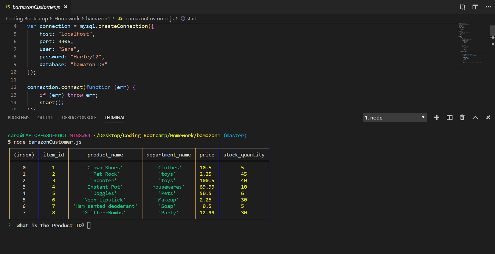

# bamazon

In this app I created a site to showcase merchandise for users to purchase online. This is someting no one has ever done before obvously. Why I am not a milionare yet is beyond me. 

##cute but what is the point of this?

the point beyond the fact that this is a homework assignment is to create a database that keeps track of 
the websites stock and can inform the user if the quantity requested is insufficiant.

## what tools are used to create this

1. MySQL
2. Node

## how to use it

1. in the terminal type node bamazonCustomer.js
    below you will see a table of products

2. once you are able to view the table choose an item
    like some clown shoes for example: 

3. the terminal will prompt the user 
by asking for an ID number. In this case it is #1

4. The terminal will then prompt the user as to how many items they want to purchse
Considering how many clowns are in this bootcamp lets get a bunch. How about 6?

5. In this case my company only carreis a few clown shoes 5 to be exact and so we dont have enough
    Luckily, my website is smart enough to know this and lets the customer know that the order cannot
    be processed.

6. Let's try this again. How about we purchase some glitter bombs, who doest love those?

Sucsess! The user was able to purchse the ammount and the database made sure to make the changes to 27. WOOO!